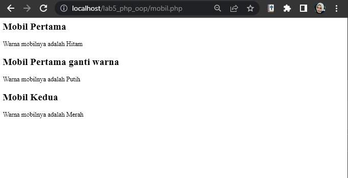
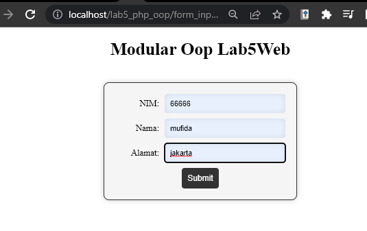

# Lab5Web

>Dengan membuat file baru dengan nama mobile.php dan memasukan kode dibawah ini.
```
<?php

class Mobil
{
    private $warna;
    private $merk;
    private $harga;

    public function __construct()
    {
        $this->warna = "Hitam";
        $this->merk = "Rolls-Royce Boat Tail";
        $this->harga = "450000000000";
    }

    public function set_warna($value)
    {
        $this->warna = $value;
    }

    public function get_warna()
    {
        return "Warna mobilnya adalah " . $this->warna;
    }
}

// Deklarasi class
$mobil_pertama = new Mobil();
$mobil_kedua = new Mobil();

// Memanggil object
?>

<h2>Mobil Pertama</h2>

<?= $mobil_pertama->get_warna(); ?>

<h2>Mobil Pertama ganti warna</h2>

<?php
$mobil_pertama->set_warna("Putih");
echo $mobil_pertama->get_warna(); 
?>

<h2>Mobil Kedua</h2>

<?php
$mobil_kedua->set_warna("Merah");
echo $mobil_kedua->get_warna();
```

### Maka akan muncul tampilan seperti gambar dibawah ini.


### Membuat class library
> membuat file baru dengan nama form_input.php, dan masukan kode dibawah ini
```
<?php
require_once 'includes/database.php';
require_once 'includes/form.php';

$db = new Database();
$conn = $db->getConnection();
$form = new Form($conn);
?>

<!DOCTYPE html>
<html>
<head>
<head>
  <meta name="viewport" content="width=device-width, initial-scale=1.0">
</head>

	<title>Modular Oop Lab5Web</title>
  <link rel="stylesheet" type="text/css" href="includes/form.css">
</head>
<body>
	<h1>Modular Oop Lab5Web</h1>
	<?php
	// Check if form is submitted
	if ($_SERVER['REQUEST_METHOD'] == 'POST') {
		// Process form data
		$form->processForm($_POST);
	}
	// Display form
	$form->displayForm();
	?>
</body>
</html>
```

### Selanjutnya membuat folder baru di dalam forlder Lab5Web, dengan nama folder includes.
> didalam folder includes membuat file baru dengan nama from.php dan memasukan kode dibawah ini.
```
<?php
class Form {
	private $conn;

	public function __construct($conn) {
		$this->conn = $conn;
	}

	public function displayForm() {
		echo '<form method="POST" action="' . htmlspecialchars($_SERVER["PHP_SELF"]) . '">';
		echo '<label for="nim">NIM:</label>';
		echo '<input type="number" name="nim" required><br>';
		echo '<label for="nama">Nama:</label>';
		echo '<input type="text" name="nama" required><br>';
		echo '<label for="alamat">Alamat:</label>';
		echo '<input type="text" name="alamat" required><br>';
		echo '<input type="submit" value="Submit">';
		echo '</form>';
	}

	public function processForm($data) {
		$nim = $data['nim'];
		$nama = $data['nama'];
		$alamat = $data['alamat'];

		$sql = 'INSERT INTO data_mahasiswa (nim, nama, alamat) VALUES (?, ?, ?)';
		$stmt = $this->conn->prepare($sql);
		$stmt->bindParam(1, $nim);
		$stmt->bindParam(2, $nama);
		$stmt->bindParam(3, $alamat);
		$stmt->execute();
	}
}
?>
```
> lakukan hal yang sama dengan memberi nama file baru yaitu database.php untuk database conection dan query.
```
<?php
require_once 'config.php';

class Database {
	private $conn;

	public function __construct() {
		$this->conn = new mysqli(DB_HOST, DB_USER, DB_PASS, DB_NAME);
		if ($this->conn->connect_error) {
			die('Connection failed: ' . $this->conn->connect_error);
		}
	}

	public function getConnection() {
		return $this->conn;
	}
}
?>
```
> lakukan hal yang sama di dalam folder includes dengan memberi nama file config.php
```
<?php
define('DB_HOST', 'localhost');
define('DB_USER', 'root');
define('DB_PASS', '');
define('DB_NAME', 'latihan1');
?>
```
### Agar tampilan lebih menarik kita menabahkan file dengan nama form.css
>berikut adalah tampilan


Terimakasih :)